# scam-guardian (Automated Phishing Analysis & Takedown Sandbox)

**scam-guardian** là một công cụ tự động phân tích và phản ứng nhanh trước các trang web lừa đảo (phishing/scam) bằng ngôn ngữ **Go**, điều khiển trình duyệt ẩn danh (**Headless Chrome**). 

> [!NOTE]
> Đây là dự án được xây dựng trong quá trình học tập và nghiên cứu về chống tội phạm công nghệ cao, cụ thể là các hành vi lừa đảo trực tuyến (phishing) thu thập thông tin người dùng.

---

## 🛠️ Phân tích Chi tiết Cơ chế Hoạt động

Khi tội phạm mạng thiết lập các trang web lừa đảo, chúng thường triển khai nhiều kỹ thuật che giấu (như chặn User-Agent lạ, chỉ hiển thị form khi có tương tác người dùng, hoặc mã hóa mã nguồn JavaScript). Các script cào web thông thường (như Curl/Python requests) sẽ bị chặn hoặc không hiển thị được nội dung. **scam-guardian** giải quyết triệt để vấn đề này qua cơ chế sau:

```mermaid
graph TD
    Target[URL Nghi Ngờ] -->|Docker Sandbox| Chromedp[Headless Chrome Instance]
    Chromedp -->|1. Render & Execute JS| DOM[Page Source & Forms]
    Chromedp -->|2. Visual Snapshot| Screenshot[screenshot.png]
    
    DOM -->|3. Phân tích Dấu hiệu| Heuristic[Heuristic Detector]
    Heuristic -->|Nhận diện Form OTP, Password, Card| RiskScore[Tính toán Risk Score]
    
    Target -->|4. Tra cứu WHOIS| Whois[Registry Database]
    Whois -->|Lấy thông tin Nhà cung cấp & Abuse Email| Takedown[Takedown Engine]
    
    RiskScore -->|Kết hợp dữ liệu| Report[abuse_report.txt]
    Takedown -->|Soạn thảo văn bản pháp lý| Report
    
    style Chromedp fill:#1e293b,stroke:#3b82f6,stroke-width:2px;
    style Heuristic fill:#1e293b,stroke:#eab308,stroke-width:2px;
    style Takedown fill:#1e293b,stroke:#ef4444,stroke-width:2px;
```



---

## 🔍 Phân tích Cơ chế Từng Phần

### 1. Trình duyệt Ẩn danh Cách ly (`main.go` - Chromedp Sandbox)
*   **Cách thức:** Hệ thống khởi dựng một instance Chrome không giao diện (Headless) nằm hoàn toàn trong môi trường Docker cách ly (sandbox).
*   **Bypass Detection:** Trình duyệt thực hiện truy cập trang web mục tiêu, thực thi toàn bộ mã nguồn JavaScript động, chờ trang web render xong trong 2 giây rồi mới bắt đầu bóc tách thông tin. Điều này giúp vượt qua các bộ lọc chống bot đơn giản của hacker.
*   **Bằng chứng Số:** Tự động gọi lệnh chụp ảnh màn hình toàn trang (`chromedp.FullScreenshot`) để lưu lại giao diện lừa đảo làm bằng chứng pháp lý gửi cho nhà mạng.

### 2. Bộ máy Phân tích Heuristic (`detector.go`)
*   **Cơ chế:** Thay vì chỉ tìm các từ khóa tĩnh, hệ thống quét cấu trúc cây thư mục DOM của trang web để phát hiện:
    *   **Form thu thập thông tin:** Tìm kiếm các thẻ `input` có thuộc tính nhạy cảm như mật khẩu (`password`), mã xác thực OTP (`otp`, `token`, `verification`), hay thẻ tín dụng (`card`, `cvv`, `ccnum`).
    *   **Kỹ thuật tự bảo vệ của Hacker:** Quét các chuỗi script chặn nhấp chuột phải (`contextmenu`), chặn phím F12/Developer Tools (`devtools`, `debugger`, `preventdefault`) thường được hacker cài vào để ngăn người dùng thông thường xem mã nguồn hoặc phân tích trang.
    *   **Thương hiệu bị nhắm tới:** Kiểm tra sự xuất hiện của các từ khóa thương hiệu lớn hay bị giả mạo (ví dụ: PayPal, MetaMask, Binance, các ngân hàng phổ biến).
*   **Tính toán Điểm rủi ro:** Gán trọng số tương ứng cho từng dấu hiệu để cho ra điểm số rủi ro (`RiskScore`) từ 0 đến 100.

### 3. Tra cứu Pháp lý & Takedown (`takedown.go`)
*   **Cơ chế:** Trích xuất tên miền gốc (Domain) của URL lừa đảo, sau đó thực hiện truy vấn WHOIS trực tiếp tới các máy chủ Registry toàn cầu.
*   **Trích xuất Abuse Contact:** Phân tích dữ liệu WHOIS trả về để tìm ra nhà cung cấp tên miền (Registrar) và Email tiếp nhận báo cáo lạm dụng (`Abuse Email`) của họ.
*   **Soạn thảo Báo cáo Tự động:** Nếu trang web có mức độ rủi ro cao (Risk Score >= 40), hệ thống tự động sinh ra một email báo cáo triệt phá (Abuse Report) chuyên nghiệp bằng tiếng Anh chứa đầy đủ bằng chứng kỹ thuật, các lỗ hổng phát hiện được và yêu cầu nhà mạng khóa ngay lập tức trang web đó.

---

## 📦 Hướng dẫn Cài đặt & Vận hành

### Bước 1: Build Container
Do Chromium yêu cầu nhiều thư viện hệ thống phức tạp, Dockerfile đã được cấu hình sẵn để cài đặt Chromium Headless chạy trong Debian Linux:
```bash
docker compose build
```

### Bước 2: Chạy Phân tích Một trang web
Chạy lệnh phân tích URL mục tiêu (thay thế URL bằng trang bạn muốn phân tích) và xuất kết quả ra thư mục `output` trên máy của bạn:
```bash
docker compose run --rm scam-guardian https://example-scam-site.com
```

### Bước 3: Nhận Kết quả Đầu ra
Sau khi chạy xong, trong thư mục `./output` của bạn sẽ xuất hiện 2 file:
1.  `screenshot.png`: Ảnh chụp màn hình trang web thực tế khi nó render trong sandbox.
2.  `abuse_report.txt`: File chứa email báo cáo triệt phá soạn sẵn để bạn gửi cho nhà mạng.
