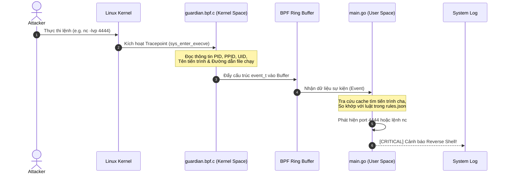

# kernel-guardian (eBPF HIDS Agent)

**kernel-guardian** là một Host Intrusion Detection System (HIDS) agent được xây dựng bằng công nghệ **eBPF (Extended Berkeley Packet Filter)** kết hợp với ngôn ngữ **Go**. 

> [!NOTE]
> Đây là dự án được xây dựng trong quá trình học tập và nghiên cứu về an ninh mạng, tập trung vào việc giám sát hành vi hệ thống ở mức nhân (kernel-space) để phát hiện mã độc, reverse shell và leo thang đặc quyền.

---

## 🛠️ Phân tích Chi tiết Cơ chế Hoạt động

Hệ thống được chia thành 2 phần chính: **Kernel-space (Trình theo dõi mức nhân)** và **User-space (Trình xử lý mức ứng dụng)**. Chúng giao tiếp với nhau qua một kênh truyền tốc độ cao gọi là **BPF Ring Buffer**.



---

## 🔍 Giải thích Từng Thành phần & Cơ chế

### 1. Phần nhân giám sát: `guardian.bpf.c` (Kernel Space)
Đây là chương trình C được biên dịch thành bytecode eBPF và nạp trực tiếp vào Linux Kernel. Nó hoạt động bằng cách "hook" (móc) vào các sự kiện hệ thống:

* **Móc nối Sự kiện Thực thi (`sys_enter_execve`):**
  - Mỗi khi có bất kỳ tiến trình nào chạy một lệnh hoặc file thực thi mới (như chạy `ls`, `bash`, `nc`), Linux kernel kích hoạt tracepoint này.
  - Chương trình eBPF sẽ đọc thông tin: **PID** (ID tiến trình), **UID** (ID người dùng chạy lệnh để biết có phải root không), **PPID** (ID của tiến trình cha sinh ra nó), tên lệnh (`comm`) và đường dẫn file được thực thi (`filename`).
* **Móc nối Sự kiện Kết nối Mạng (`sys_enter_connect`):**
  - Mọi hành vi tạo kết nối mạng đi ra ngoài (outbound socket connection) đều kích hoạt tracepoint này.
  - eBPF sẽ đọc cấu trúc địa chỉ socket (`sockaddr_in`) để lấy **IP đích** và **Port đích** mà tiến trình đang muốn kết nối tới.
* **Cơ chế Ring Buffer:**
  - Vì code chạy trong nhân cần tốc độ cực nhanh để tránh làm chậm hệ điều hành, eBPF ghi nhận sự kiện rồi đẩy ngay vào một vùng nhớ chia sẻ chung gọi là **Ring Buffer**. User-space sẽ đọc từ đây ra. Cơ chế này không gây nghẽn và tốn rất ít tài nguyên.

---

### 2. Trình xử lý trung tâm: `main.go` (User Space)
Đây là chương trình viết bằng Go chạy ở môi trường người dùng thông thường để điều khiển và phân tích:

* **Nạp Bytecode vào Kernel:**
  - Khi khởi động, Go sử dụng thư viện `cilium/ebpf` để giao tiếp với hệ điều hành, yêu cầu cấp quyền và nạp bytecode đã biên dịch từ `guardian.bpf.c` vào các Tracepoint tương ứng của nhân Linux.
* **Cây tiến trình động (Process Lineage Tracking):**
  - Thông thường, Kernel chỉ trả về số PID và PPID vô hồn. Agent Go giải quyết bằng cách duy trì một bộ nhớ đệm (cache map). 
  - Mỗi khi có một tiến trình mới chạy, Agent ghi nhận `PID -> Tên tiến trình`. Khi tiến trình con chạy tiếp theo, Agent tra ngược `PPID` trong cache để tìm ra tên của tiến trình cha.
  - Kết quả hiển thị trực quan: `[nginx (PID: 100) -> sh (PID: 101)]` giúp bạn thấy ngay ai là thủ phạm sinh ra shell.
* **Bộ luật Phân tích động (`rules.json`):**
  - Agent đọc danh sách các cổng kết nối nhạy cảm (như `4444`, `9001` - thường là reverse shell) và các công cụ đáng ngờ (như `nc`, `nmap`).
  - Nếu phát hiện tiến trình thuộc nhóm Web Server (như `nginx`, `apache`) sinh ra tiến trình con là một shell (`sh`, `bash`), hệ thống ngay lập tức kích hoạt cảnh báo **CRITICAL** vì đây là dấu hiệu điển hình của lỗ hổng RCE (Remote Code Execution) hoặc Web Shell.

---

### 3. Tự động hóa Môi trường: `run.sh` & `Dockerfile`
Biên dịch eBPF truyền thống rất phức tạp do phụ thuộc vào phiên bản nhân Linux cụ thể (Kernel Headers). Dự án giải quyết triệt để bằng cơ chế biên dịch động:

* **Tự sinh `vmlinux.h`:** 
  - Khi container Docker khởi chạy, script `run.sh` dùng công cụ `bpftool` để kết xuất (dump) toàn bộ cấu trúc dữ liệu của nhân hệ điều hành đang chạy thành file header `vmlinux.h`. Điều này đảm bảo code eBPF biên dịch ra tương thích tuyệt đối với máy của bạn.
* **Biên dịch tại chỗ (On-the-fly Compilation):**
  - Sau khi có `vmlinux.h`, script tự chạy `go generate` (gọi clang để biên dịch file C thành ELF bytecode) và `go build` để ra file thực thi hoàn chỉnh trong vòng 3 giây trước khi chạy.

---

## ⚙️ Hướng dẫn Chạy Thử nghiệm

### Bước 1: Build Container
Cài đặt môi trường và các công cụ biên dịch tự động:
```bash
docker compose build
```

### Bước 2: Chạy Agent Giám sát
Chạy container với quyền privileged để nạp code vào nhân:
```bash
docker compose up
```

### Bước 3: Chạy giả lập tấn công (Mở terminal khác trên máy host)
Cấp quyền và chạy script test giả lập:
```bash
chmod +x test_exploit.sh
./test_exploit.sh
```

### Bước 4: Kiểm tra kết quả
Quan sát log hiển thị ở terminal chạy Agent để thấy cơ chế phát hiện hoạt động thời gian thực.
